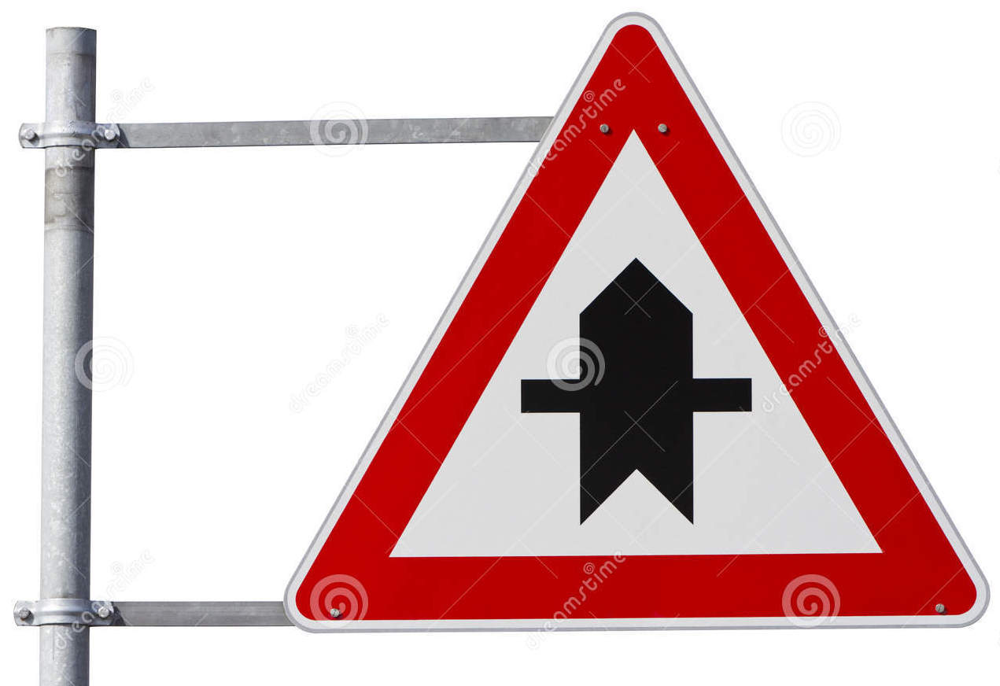

# **Traffic Sign Recognition** 

## Writeup

### You can use this file as a template for your writeup if you want to submit it as a markdown file, but feel free to use some other method and submit a pdf if you prefer.

---

**Build a Traffic Sign Recognition Project**

The goals / steps of this project are the following:
* Load the data set (see below for links to the project data set)
* Explore, summarize and visualize the data set
* Design, train and test a model architecture
* Use the model to make predictions on new images
* Analyze the softmax probabilities of the new images
* Summarize the results with a written report


[//]: # "Image References"

[image1]: ./examples/visualization.jpg "Visualization"
[image2]: ./examples/grayscale.jpg "Grayscaling"
[image3]: ./examples/random_noise.jpg "Random Noise"
[image4]: ./examples/placeholder.png "Traffic Sign 1"
[image5]: ./examples/placeholder.png "Traffic Sign 2"
[image6]: ./examples/placeholder.png "Traffic Sign 3"
[image7]: ./examples/placeholder.png "Traffic Sign 4"
[image8]: ./examples/placeholder.png "Traffic Sign 5"
[speed_limit_80]: ./test_images/speed_limit_80.jpg "speed_limit_80"

---
### Data Set Summary & Exploration

#### 1. Provide a basic summary of the data set. In the code, the analysis should be done using python, numpy and/or pandas methods rather than hardcoding results manually.

I used the pandas library to calculate summary statistics of the traffic
signs data set:

* The size of training set is ?
  * 34799
* The size of the validation set is ?
  * 4410
* The size of test set is ?
  * 12630
* The shape of a traffic sign image is ?
  * 32x32x3
    * due to RGB images
* The number of unique classes/labels in the data set is ?
  * 43 classes

```python
Number of training examples = 34799
Number of validation examples = 4410
Number of testing examples = 12630
Image data shape = (32, 32, 3)
Number of classes = 43
```

#### 2. Include an exploratory visualization of the dataset.

Here is an exploratory visualization of the data set. It is a bar chart showing how the data ...

- Training dataset


- Validation dataset


- Histogram for class distribution


### Design and Test a Model Architecture

#### 1. Describe how you preprocessed the image data. What techniques were chosen and why did you choose these techniques? Consider including images showing the output of each preprocessing technique. Pre-processing refers to techniques such as converting to grayscale, normalization, etc. (OPTIONAL: As described in the "Stand Out Suggestions" part of the rubric, if you generated additional data for training, describe why you decided to generate additional data, how you generated the data, and provide example images of the additional data. Then describe the characteristics of the augmented training set like number of images in the set, number of images for each class, etc.)

| No.image  |         Technique          |
| :-------: | :------------------------: |
| 1st image |          Original          |
| 2nd image |       **Grayscale**        |
| 3rd image | **Histogram Equalization** |
| 4th image |     **Normalization**      |


1. I decided to convert the images to grayscale.

   - As color images, the shape of a traffic sign image is 32x32x3. To reduce size of these, it needs to be converted to the grayscale images. Then, the shape of images can be 32x32x1.

2. The reason why I use the histogram equalization

   - If the histogram of an image is too focused on a specific area, it can not be a good image because the contrast is low. It is a good image when the whole area is evenly distributed. Histogram Equalization is the process of distributing the distribution centered on a specific area to the right image below as shown on the left image below.

   

3. Choose to scale the normalized data in the range [-1,1].

   -  Data normalization is an important step which ensures that each input parameter (pixel, in this case) has a similar data distribution.
   - This makes convergence faster while training the network. 
   - Data normalization is done by subtracting the mean from each pixel, and then dividing the result by the standard deviation.
     - $ (pixel - 128)/128 = (pixel/128) - 1$
   - The normalization image compared with the original image

4. 


#### 2. Describe what your final model architecture looks like including model type, layers, layer sizes, connectivity, etc.) Consider including a diagram and/or table describing the final model.

My final model consisted of the following layers:

| Layer         		|     Description	        					|
|:---------------------:|:---------------------------------------------:|
| Input         		| 32x32x1 Grayscale image |
| Convolution 5x5     	| 1x1 stride, VALID padding, outputs 28x28x48 |
| RELU					| Activation function |
| Max pooling	      	| 2x2 stride,  VALID padding, outputs 14x14x48 |
| Convolution 5x5	| 1x1 stride, VALID padding, outputs 10x10x128 |
| RELU	| Activation function |
| Max pooling	| 2x2 stride,  VALID padding, outputs 5x5x128 |
| Flatten | 3200 |
| Fully Connected | Input 3200, Output 120 |
| RELU | Activation function |
| Dropout | 0.8 |
| Fully Connected | Input 120, Output 84 |
| RELU | Activation function |
| Fully Connected | Input 84, Output 43 |


#### 3. Describe how you trained your model. The discussion can include the type of optimizer, the batch size, number of epochs and any hyperparameters such as learning rate.

The following are the hyperparameters used:

- Batch size: 128
- Epoch : 30
- Learning rate: 0.001
- Standard deviation (sigma): 0.1
- Mean: 0.0 

#### 4. Describe the approach taken for finding a solution and getting the validation set accuracy to be at least 0.93. Include in the discussion the results on the training, validation and test sets and where in the code these were calculated. Your approach may have been an iterative process, in which case, outline the steps you took to get to the final solution and why you chose those steps. Perhaps your solution involved an already well known implementation or architecture. In this case, discuss why you think the architecture is suitable for the current problem.

My final model results were:

* training set accuracy of ? 
  * **98.78 %**
* validation set accuracy of ? 
  * **94.68 %**
* test set accuracy of ? 
  * **94.49 %**


### Test a Model on New Images

#### 1. Choose five German traffic signs found on the web and provide them in the report. For each image, discuss what quality or qualities might be difficult to classify.

Here are ten German traffic signs that I found on the web:

1. Road work


2. Speed limit (80km/h)


3. Priority road  


4. Wild animals crossing  


5. Double curve


6. Bumpy road


7. No entry


8.  Roundabout mandatory 


9. Right-of-way at the next intersection  



10. Stop


#### 2. Discuss the model's predictions on these new traffic signs and compare the results to predicting on the test set. At a minimum, discuss what the predictions were, the accuracy on these new predictions, and compare the accuracy to the accuracy on the test set (OPTIONAL: Discuss the results in more detail as described in the "Stand Out Suggestions" part of the rubric).

Here are the results of the prediction:

| Image			        |     Prediction	        					|
|:---------------------:|:---------------------------------------------:|
| Road work | Road work   |
| Speed limit (80km/h) | Slippery road |
| Priority road	| Priority road	|
| Wild animals crossing	| Wild animals crossing	|
| Double curve	| Stop      			|
| Bumpy road	| Vehicles over 3.5 metric tons prohibited |
| No entry	| Turn right ahead |
| Roundabout mandatory	| Priority road |
| Right-of-way at the next intersection	| Bicycles crossing |
| Stop	| Stop |


The model was able to correctly guess 4 of the 10 traffic signs, which gives an accuracy of 40%. 

#### 3. Describe how certain the model is when predicting on each of the five new images by looking at the softmax probabilities for each prediction. Provide the top 5 softmax probabilities for each image along with the sign type of each probability. (OPTIONAL: as described in the "Stand Out Suggestions" part of the rubric, visualizations can also be provided such as bar charts)

The code for making predictions on my final model is located in the 22th cell of the Ipython notebook.

For the first image, the model is relatively sure that this is a road work sign (probability of 0.49), and the image does contain a road work sign. The top five soft max probabilities were below.

|              True image               |                         Predictions                          |  Comment  |
| :-----------------------------------: | :----------------------------------------------------------: | :-------: |
|               Road work               | 49.22 % - Road work <br/>  16.86 % - Wild animals crossing   <br/>	12.40 %  Dangerous curve to the left <br/>11.19 %  Bicycles crossing <br/>8.06 %  Slippery road |  Correct  |
|         Speed limit (80km/h)          | 90.27 %  Slippery road<br/>6.03 %  Wild animals crossing<br/>   1.98 %  Road work<br/>0.42 %  Speed limit (50km/h)<br/>	0.31 % - General caution | Incorrect |
|             Priority road             | 95.41 %  Priority road<br/>2.26 %  Ahead only<br/>  0.64 %  Right-of-way at the next intersection<br/>0.28 %  Go straight or right<br/>	0.27 %  Roundabout mandatory |  Correct  |
|         Wild animals crossing         | 99.78 %  Wild animals crossing<br/>0.21 %  Double curve<br/> 0.00 %  Slippery road<br/>0.00 %  Beware of ice/snow<br/>	0.00 %  Right-of-way at the next intersection |  Correct  |
|             Double curve              | 50.70 %  Stop<br/>23.13 %  Roundabout mandatory<br/>13.44 %  Speed limit (60km/h)<br/>2.77 %  Yield<br/>	2.69 %  Go straight or right | Incorrect |
|              Bumpy road               | 90.57 %  Vehicles over 3.5 metric tons prohibited<br/>7.26 %  Roundabout mandatory<br/> 1.23 %  Right-of-way at the next intersection<br/>0.45 %  End of no passing by vehicles over 3.5 metric tons<br/>	0.31 %  End of no passing | Incorrect |
|               No entry                | 32.76 %  Turn right ahead<br/>20.50 %  Stop<br/>17.20 %  Yield<br/>6.08 %  Speed limit (120km/h)<br/>	5.53 %  Speed limit (30km/h) | Incorrect |
|         Roundabout mandatory          | 79.46 %  Bicycles crossing<br/>12.58 %  Road narrows on the right<br/>3.76 %  Speed limit (60km/h)<br/>2.26 %  Speed limit (80km/h)<br/>1.49 %  Ahead only | Incorrect |
| Right-of-way at the next intersection | 99.78 %  Wild animals crossing<br/>0.21 %  Double curve<br/> 0.00 %  Slippery road<br/>0.00 %  Beware of ice/snow<br/>	0.00 %  Right-of-way at the next intersection | Incorrect |
|                 Stop                  | 62.16 %  Stop<br/>37.82 %  Yield<br/> 0.01 %  Ahead only<br/>0.01 %  Turn right ahead<br/>	0.00 %  Speed limit (50km/h) |  Correct  |

### (Optional) Visualizing the Neural Network (See Step 4 of the Ipython notebook for more details)
#### 1. Discuss the visual output of your trained network's feature maps. What characteristics did the neural network use to make classifications?


